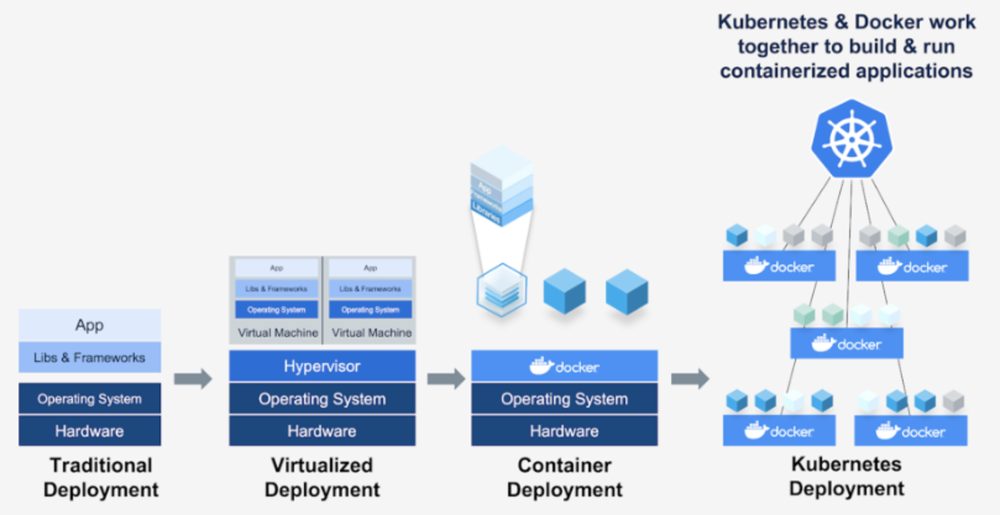
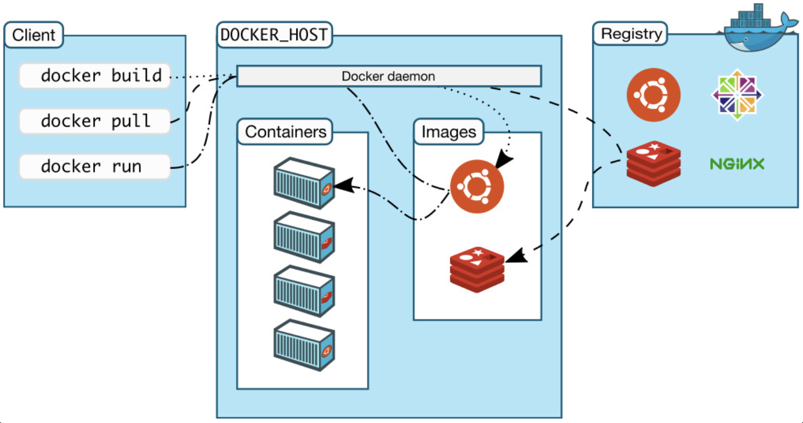
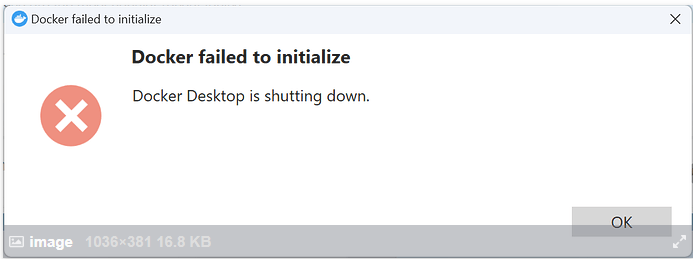

# [Container](https://captcha.tistory.com/46)
- 컨테이너란 호스트 OS상에 논리적인 구획(컨테이너)을 만들고, 어플리케이션을 작동시키기 위해 필요한 라이브러리나 어플리케이션 등을 하나로 모아, 마치 별도의 서버인 것처럼 사용할 수 있게 만든 것입니다. 

### 컨테이너(Container)를 사용해야 하는 이유
- 컨테이너는 훨씬 가볍고 운영체제 커널을 공유하며, 시작이 훨씬 빠르고 운영체제 전체 부팅보다 메모리를 훨씬 적게 차지합니다.
---
# [컨테이너 기술의 발전 과정](https://ahnty0122.tistory.com/160)

---
### Traditional Deployment
- 하드웨어 위에 OS 설치 후 App 실행에 필요한 Library를 OS에 설치
- 다양한 서비스를 한 서버에서 운영해야 하는 문제가 발생 (비용 효율성)
- 서비스간 라이브러리 충돌이 발생함에 까라 서비스간 환경 격리가 요구됨
### Virtualized Deployment
- Hypervisor: VM(Virtual Machine)을 관리하는 역할을 함
- Guest OS(VM)에 하드웨어 자원을 에뮬레이팅을 하다보니 성능 하락이 발생하며, 가상머신을 띄우기 위한 자원의 오버헤드가 발생
---
### Container Deployment
- Docker : 대표적인 Container Engine
- chroot, namespace 등을 이용한 격리기술 제공
- Host Process에서 실행되는 환경이기에 성능하락과 자원 오버헤드 문제에서 벗어남
### Kubernetes Deployment
- Kubernetes : 대표적인 Container Orchestration System
- 여러 서버에서 구성된 환경에서 Container를 어떻게 잘 운영할 수 있는지 목적으로 함
---
# [Docker](https://seosh817.tistory.com/345)
- Docker는 애플리케이션을 신속하게 구축, 테스트 및 배포할 수 있는 소프트웨어 플랫폼입니다.

## virtual Machine vs Docker Container

---
- virtual Machine
  - 성능 손실 발생: 시스템 자원을 가상화하고 독립된 공강을 생성하는 작업(HyperVisor)을 거침
  - 배포가 느려짐: 실행 파일 이외에 Guest OS 등이 추가됨으로써 용량이 큼
- Docker Container
  - 성능 손실 없음: 리눅스 자체 기능을 사용하여 프로세스 단위의 격리 환경을 구축
  - 배포가 빠름: 실행 파일 및 라이브러리만 필요하여 용량이 적음  
---
## 도커 구성요소

---
- Docker Client
  - 도커를 설치하면 그것이 Client며, build, pull, run 등의 도커 명령어를 수행합니다.
- Docker Host
  - 도커가 띄워져있는 서버를 의미합니다.
  - 컨테이너와 이미지를 관리하게 됩니다.
- Docker daemon
  - 도커 엔진입니다.
- Registry
  - 외부(remote) 이미지 저장소입니다.
---
## 도커 이미지와 도커 컨테이너
- 도커 이미지와 컨테이너는 `1:N` 관계입니다.

---
## [도커 이미지 만들어지는 과정](https://khj93.tistory.com/entry/Docker-Docker-%EA%B0%9C%EB%85%90)
- ubuntu 이미지: Layer A,B,C 
- nginx 이미지: unbuntu + nginx Layer
- web app 이미지: nginx + web app source Layer

---
## 주요 용어 정리 
- DockerFile
  - Docker 이미지의 빌드 방법에 관한 지시사항이 포함된 파일입니다.
- Docker 이미지
  - 소프트웨어 실행시 필요한 모든 것들(소스코드, 라이브러리 등)이 포함되어 있습니다.
- Docker 컨테이너 
  - Docker 이미지의 현재 실행 중인 라이브 인스턴스입니다. 
- Docker Hub 
  - Docker Hub는 공용 Docker 이미지 저장소입니다. 

---
# Docker 사용법 
### [1. Docker 설치하기](./docker_install.md) 
### [2. Docker 기본명령어](./docker_basic.md) 
### [3. Dockerfile](./docker_file.md)
### [4. Docker Network](./docker_network.md)
### [5. Docker Compose](./docker_compose.md)

---
# [Docker failed to initailize](https://github.com/docker/for-win/issues/12523#issuecomment-1029156833)

