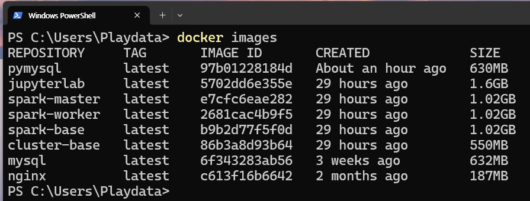
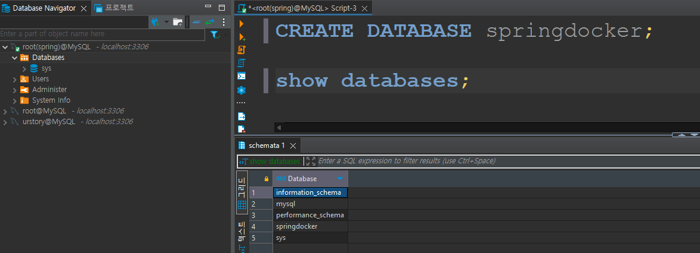
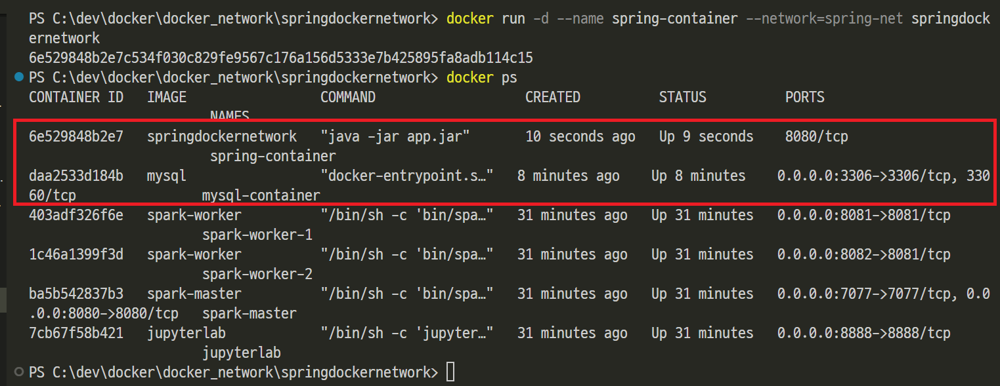

# Docker Network

---
### Docker Network 생성
```shell
docker network create spring-net
docker network ls
```


---
# MySQL 

---
### 단계1: MySQL Image 
```shell
docker images

# 만약 없다면,
docker pull mysql
```


---
### 단계2: MySQL Container
```shell
docker run -d --name mysql-container -p 3306:3306 -e MYSQL_ROOT_PASSWORD=pass mysql

docker ps
```


---
### 단계3: dbeaver 및 CREATE DATABASE
```sql
CREATE DATABASE springdocker;

show databases;
```


---
### 단계4: Network Connect
```shell
docker network connect spring-net mysql-container
```


---
# SpringBoot JPA

---
### 단계1:  dependencies
```gradle
dependencies {
	implementation 'org.springframework.boot:spring-boot-starter-data-jpa'
	implementation 'org.springframework.boot:spring-boot-starter-web'
	compileOnly 'org.projectlombok:lombok'
	runtimeOnly 'com.mysql:mysql-connector-j'
	annotationProcessor 'org.projectlombok:lombok'
	testImplementation 'org.springframework.boot:spring-boot-starter-test'
}
```

---
### 단계2: application.yaml
```yaml
spring:
    output:
        ansi:
            enabled: always
    # 데이터베이스 설정 
    datasource:
        # jdbc:mysql://[mysql 도커 컨테이너명]:3306/[database이름]
        url: jdbc:mysql://mysql-container:3306/springdocker?userSSL=false&allowPublicKeyRetrieval=true&serverTimezone=Asia/Seoul
        username: root
        password: pass
        driver-class-name: com.mysql.cj.jdbc.Driver
    # jpa 설정 
    jpa:
        hibernate:
            ddl-auto: update
        properties:
            hibernate:
                show_sql: true
                format_sql: true
                
```
---
### 단계3: @SpringBootTest & @Test 주석처리 
- Test 과정에서 JPA가 MySQL 접속하는 과정에 오류가 발생할 수 있음 
- 아직 MySQL이 포함된 docker network에 접속을 할 수 없기 때문에 오류가 발생함 


---
### 단계4: Dockerfile
```docker
FROM gradle:7.6-jdk17-alpine as build

ENV APP_HOME=/apps

WORKDIR $APP_HOME

COPY build.gradle settings.gradle gradlew $APP_HOME

COPY gradle $APP_HOME/gradle

RUN chmod +x gradlew

RUN ./gradlew build || return 0

COPY src $APP_HOME/src

RUN ./gradlew clean build

FROM openjdk:17.0.2-jdk

ENV APP_HOME=/apps
ARG ARTIFACT_NAME=app.jar
# ARG JAR_FILE_PATH=build/libs/[프로젝트명]-0.0.1-SNAPSHOT.jar 
ARG JAR_FILE_PATH=build/libs/springdockernetwork-0.0.1-SNAPSHOT.jar 

WORKDIR $APP_HOME

COPY --from=build $APP_HOME/$JAR_FILE_PATH $ARTIFACT_NAME

EXPOSE 8080

#ENTRYPOINT ["java", "-XX:+UnlockExperimentalVMOptions", "-XX:+UseCGroupMemoryLimitForHeap", "-Djava.security.egd=file:/dev/./urandom", "-jar", "app.jar"]
ENTRYPOINT ["java", "-jar", "app.jar"]
```
---
### 단계5: docker build
```shell
docker build -t springdockernetwork .
```


---
### 단계6: springdockernetwork
```shell
docker images
```


---
### 단계7: docker run 
```shell
docker run -d --name spring-container --network=spring-net springdockernetwork

docker ps
```


---
### 단계8: springboot jpa와 mysql 연동확인
```sql
use springdocker;

show tables;
```

