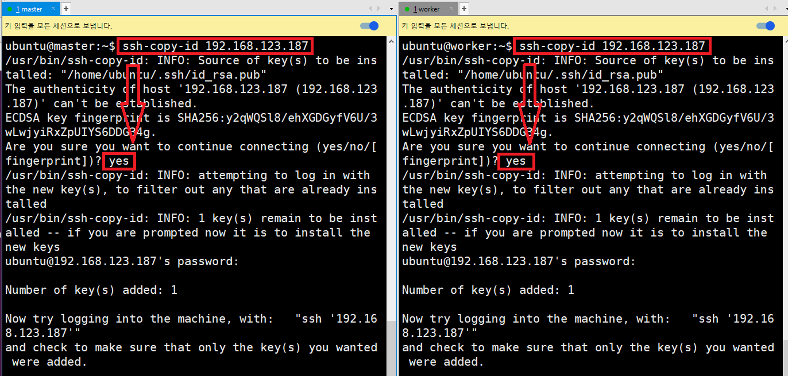
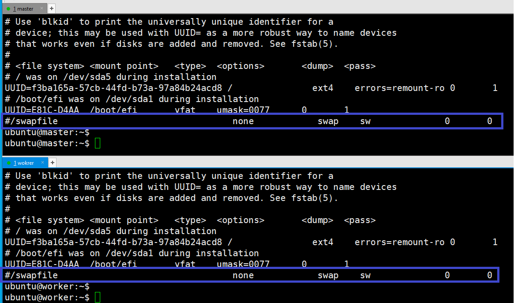
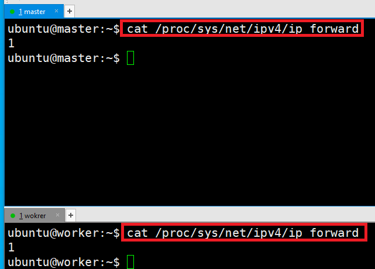

### 단계1: ip 확인 
- master: 192.168.123.113
- worker: 192.168.123.158
```shell
ifconfig
```


---
### 단계2: hosts
- 서버끼리 서로 알 수 있도록 hosts 정보도 등록해주자.
```shell
sudo vim /etc/hosts
# 아래와 같이 입력 (ip는 위에서 확인)
192.168.123.113 master
192.168.123.158 worker
```


---
### 단계3: ssh-key 생성
```shell
ssh-keygen # enter 3번 입력 
```


---
### 단계4: sshd_config 수정 
```shell
sudo vim /etc/ssh/sshd_config

# sshd_config파일에서 아래와 같이 수정 
PermitRootLogin yes # (root 로그인 허용여부를 결정함,yes, no, without-password를 사용할 수 있음) 
PasswordAuthentication yes # (열쇠글 인증을 설정하는 것으로 프로토콜 버전 1과 2 모두 적용) 
```

- restart
```shell
sudo /etc/init.d/ssh restart
```

---
### 단계5: ssh public key 교환 작업 
- 입력순서: yes & 비번 
```shell
ssh-copy-id 192.168.123.113
ssh-copy-id 192.168.123.158
```


---
### 단계6: ssh 접속 테스트 
```shell
ssh master
ssh worker
```


---
### 단계7: swap off 확인 
```shell
cat /etc/fstab
```


---
### 단계8: ip_forward 확인 
```shell
cat /proc/sys/net/ipv4/ip_forward
```



