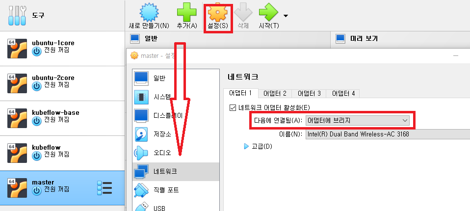
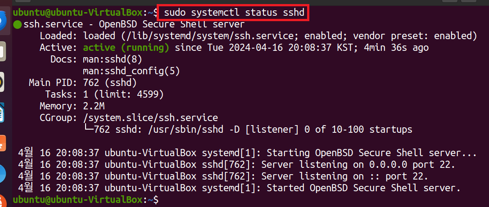
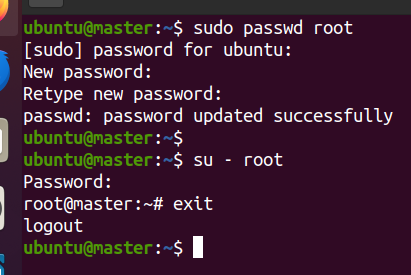
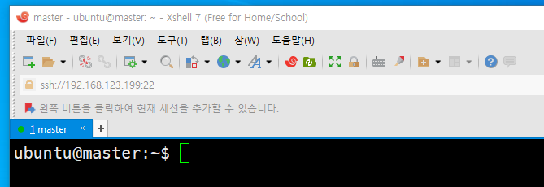

### 단계1: 하드웨어
- OS: ubuntu 20.04 LTS / CPU: 2 Core
- RAM: 4096 MB / Storage: 30 ~ 40 GB


---
### 단계2: 네트워크 
- 어댑터에 브리지 



---
### 단계3: update & install
```shell
sudo apt-get -y update &&\
sudo apt-get -y upgrade &&\
sudo apt-get -y dist-upgrade &&\
sudo apt-get install -y vim wget unzip ssh openssh-* net-tools chrony
```


---
### 단계4: ssh
- [오류발생시](https://blog.msalt.net/326)
```shell
sudo systemctl status sshd
# 실행이 안되어 있으면, 실행 
sudo service ssh start
```


---
### 단계5: hostname & Reboot
```shell
sudo hostnamectl set-hostname master
hostname
# 재기동
sudo reboot
```


---
### 단계6: root 계정 접속 
```shell
sudo passwd root # 비번 설정 
su - root # root 계정 접속
```


---
### 단계7: ifconfig
- ip: 
```shell
ifconfig
```


---
### 단계8: Xshell 접속 



